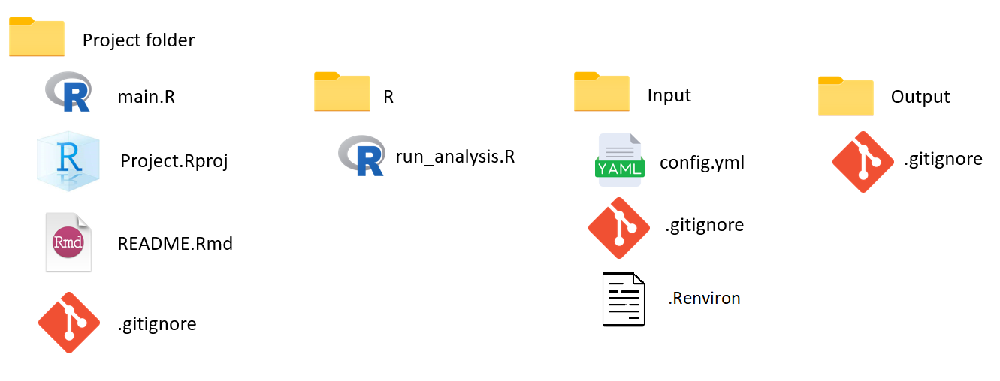
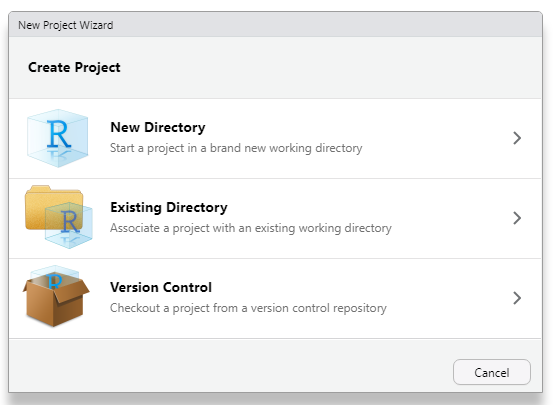
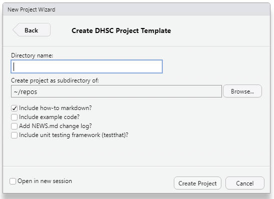

# DHSC RAP Template

::: callout-note
## Key Points

-   The DHSC RAP template provides you with the basic file structure for you RAP

-   The template provides a series of useful files to remove some the intial overhead when starting a new project.

-   The RAP template can be accessed through the `DataS-DHSC/DHSCtools` package hosted on Github.
:::

The first step to producing your RAP is creating an R project in RStudio. An R project makes it easy to move your work between different directories without having to change absolute file paths. In DHSC we have developed a project template that can be used instead of the standard version, and provides extra features.

The DHSC project template is intended to embed a standard approach to R programming at DHSC and adheres to coding best practice as set out by the [UK Government Analytical Community - Quality assurance of code for analysis and research](https://best-practice-and-impact.github.io/qa-of-code-guidance/).

The template creates a project structure that closely follows that enforced by R packages. This allows the use of automated features such as documenting and unit testing of code as well as simplifying the process of converting code to a package if needed.

The template gives you the basic file structure for your RAP, along with a variety of files that will be useful as you develop your pipeline. This removes some of the overhead in having to create these yourselves, and acts a reminder to include elements of best practice.

The next section will give a more in depth look at what is contained in the template. If you just want to know how to install it, [click here](##%20Installing%20the%20DHSCtools%20package).

## Template Structure

The aim is to write your code in a way to make it reproducible and easy to follow, with a consistent folder structure across different projects.

The template contains several folders.

-   The central project folder, with your key files.

-   An R folder in which to store the scripts containing the analysis functions.

    An input folder in which to store your data and any input parameters.

-   An output folder in which you save your RAP outputs.

The template provides a series of useful files to help you build your RAP. The key ones we'll cover in this book are:

-   `main.r` - This is the script from which you will run your code, initialise your packages, and start your logging. This script serves three purposes: it hels with portability by making sure all the packages needed in the code are installed; it explicitly sets up any global variables needed so new users can find them easily; allows new users to immediately know how to run your code by following an established pattern of sourcing main.R

-   `run_analysis` - This is the script in which you call your functions from other scripts, giving a high level view of the process. For example: download_data, process_data, display_data, save_data. This allows you to clearly set out the flow of your analysis, and helps pin point any errors.

-   `README.Rmd` - This is a document in which you will explain your project, how it works and how to run in. This is important for future users to understand how to use your work, and why you have made the choices you have.

-   `.gitignore` - While version control is essential, not all files can be shared. The gitignore files allows you to specify which files will not be pushed into a remote repo. **Data should always be included in the gitignore.**

-   `config.yml` - A config file allows you to change parameters without needing to edit the code itself. It is written in YAML, a simple structured data language. This makes using new data, and updating variables much quicker, and allows the code to be more general.

-   `.Reviron` - This file contains environment variables. These are named values that tell some external application some information. For example API keys, usernames, and passwords. These should almost always be included in your `.gitignore`.

## Using the template - Best practice

Use the `main.R` script to source and call the main function used to run your analysis and set up your environment, logging, and dependencies (using the `librarian` package). Using a standard entry point to running the analysis will help others understand and run your code more quickly and also enforces the use of modular functions.

All other scripts should be saved in the `./R` folder with code structured into separate files containing logically grouped functions. For non-packaged projects, please add a section to the start of each file that explicitly loads all dependencies (either using the `library` and `source` function for smaller projects or the `box` and `renv` packages for larger projects).

Store input parameters and settings in the `./input/config.yml` YAML file and sensitive parameters in the `.REnviron` file (this file is not version controlled by default in the template).

Store input data and settings in the `./input` folder and write any output from the analysis to the `./output` folder. These folders contain `.gitignore` files which prevent their contents from being version controlled (with the exception of `./input/config.yml`). **You should never commit data, as an input or output, to git and github. We do not own the servers where Github is hosted, and nothing sensitive should be save on them.**

It's important to manage dependencies in your project. These are when your code relies on external elements to work. The most common example of this is using packages. We need to be clear which packages we have used so future users know to install them and are able to run your code.

For small projects, we recommend using the `librarian` package and base R `source` function to manage dependencies; for larger projects we would recommend using the `renv` and `box` packages for dependency management as well as considering packaging the project itself on GitHub.

## Installing the DHSCtools package

You can install the development version of DHSCtools using:

    if (!requireNamespace("librarian")) install.packages("librarian", quiet = TRUE)
    librarian::stock(DataS-DHSC/DHSCtools)

**Note:** You will need to restart your R session (either by restarting RStudio or using *Session* \> *Restart R*) on installing to see the *DHSC Project Template* option.

## Set up your Template

After installing the package, to use the DHSC project template go to File \> New Project... then select New Directory followed by DHSC Project Template. Make sure to untick the "Include example code?" checkbox.

  

The optional example code contains similar examples to those in this book, but including them here may cause some confusion later. The optional features are:

-   A how-to markdown giving a brief overview of the template

-   Example code giving an example of a project using the template

-   A news.md change log. This is useful if you decide to package your RAP. It records the changes between different versions.

-   A unit testing framework, to help you set up and use unit testing.

::: callout-note
## Exercise: Set up your own project template

In this section, you'll set up a project template of your own. Using any required steps above, you should:

1.  Install the required packages.

2.  Download the RAP template and create a project.
:::
