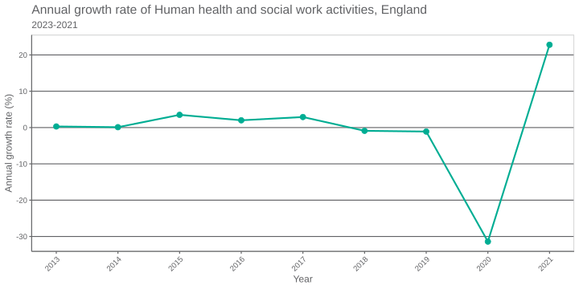

# Plotting data

::: callout-note
## Key Points

-   Your outputs should be disposable, and easily recreated

-   Output your charts as .svg files

-   Wrap up the plotting of your data into a function
:::

The outputs of your RAP should be produced with no, or minimal, intervention. The yshould be disposable, in that if you didn't save them it would be straightforward to recreate them.

Now we will plot the data using `ggplot2`.

We need to add this to our librarian section of `main.R`

Here we set up the plot - plotting a line of the values and settig the chart labels.

We use DHSC colours, which are a part of the `DHSCtools` package. We can add this to our `librarian` function in the `main.R` script.

```{r, eval = F}
# plot

ggplot(data = data_time_series_sorted,
       aes(x = Time,
           y = v4_1,
           colour = config$industry)) +
  DHSCcolours::theme_dhsc() +
  geom_line(linewidth = 1) +
  geom_point(size = 3) +
  theme(legend.position="none") +
  DHSCcolours::scale_colour_dhsc_d() +
  labs(
    title = "Annual growth rate of Human health and social work activities, England",
    subtitle = "2013-2021",
    x = "Year",
    y = "Annual growth rate (%)") +
  scale_x_continuous(breaks=seq(2013,2021,1))
```

And save the plot. We save as an SVG file, this format allows you to resize the image without losing resolution.

```{r, eval = F}
# save the plot

ggsave("./output/health_gdp_chart.svg",
         height = 5,
         width = 10,
         units="in",
         dpi=300)
```

It will look like this:

{alt="alt text"}

## Wrap in function

Again we should wrap this all up in a function to be called from the `run_analysis.R` script.

```{r, eval = F}
#' Plot data as time series
#'
#' @param data_id a string of the name of the data set to download. This is stored in config.yml as config$data_id
#' @param industry is a string of the industy we want to look at. This is stored in config.yml as config$industry
#' @param metric is a string of the metric we want to look at. This is stored in config.yml as config$metric
#' @param title is a string that will be the title of the chart
#' @param subtitle is a string that will be the subtitle of the chart
#' @param xlab is a string that is the x axis label
#' @param ylab is a string that is the y axis label
#'
#' @import DHSCtools
#' @import ggplot2
#'
#'

ts_line_chart_data <- function(data, industry, metric, title, subtitle, xlab, ylab){

  graph <- ggplot(data = data_time_series_sorted,
                  aes(x = Time,
                      y = v4_1,
                      colour = industry)) +
    DHSCcolours::theme_dhsc() +
    geom_line(linewidth = 1) +
    geom_point(size = 3) +
    theme(legend.position="none") +
    DHSCcolours::scale_colour_dhsc_d() +
    labs(
      title = title,
      subtitle = subtitle,
      x = xlab,
      y = ylab) +
    scale_x_continuous(breaks=seq(2013,2021,1))


  #save chart
  chart_path <- paste0("./output/", metric, "_", industry, "_chart.svg")

  ggsave(chart_path,
         plot = graph,
         height = 5,
         width = 10,
         units="in",
         dpi=300)

  logger$info(paste0("Graph saved to: ", chart_path))
  return(graph)

}
```

The last steps are:

-   Add new functions to `librarian` line in `main.R`
-   Add a `source` to your new function to `run_analysis.R`
-   Add the function to your function in `run_analysis.R`

::: callout-note
## Exercise: Plot your data

1.  Alter the config file to look to plot your chart correctly

2.  Run the plot data script to make sure it's working correctly. Make any necessary fixes.
:::
