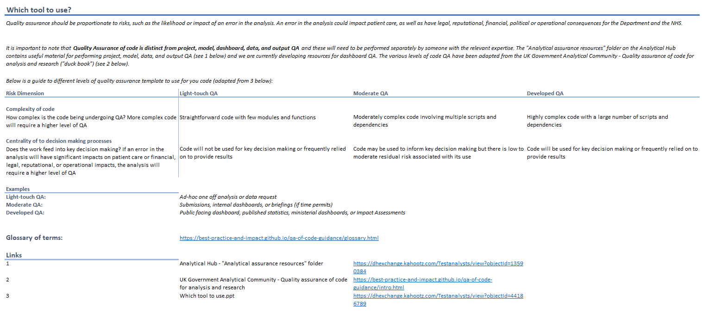
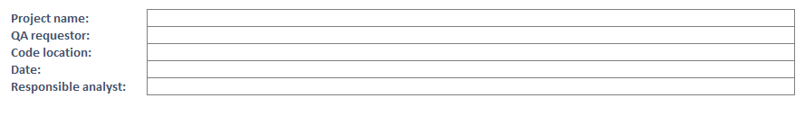
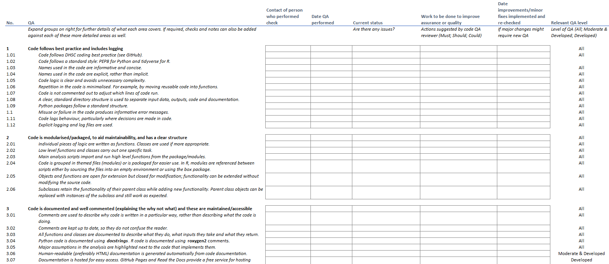

# QA Documentation Toolkit

The QA documentation toolkit is for use when implementing the RAP template. 

## QA 

Quality assurance is an essential part of all analytical work, as laid out in the 
[AquA book](https://www.gov.uk/government/publications/the-aqua-book-guidance-on-producing-quality-analysis-for-government)

This lays out the need for proportionate analytical quality assurance to ensure that analysis and supporting model, data and assumptions are fit-for-purpose.
The main QA principles should be applied to all projects: 

* Governance and Oversight
* Documentation
* Structure and Clarity
* Data and Assumptions
* Validation - Am I building the right product?
* Verification - Am I building the product right?

For more information on QA in general, please refer to the AQuA book, or departmental AQA training (e.g. Analyst Academy sessions).

## Code QA

For projects using code and using this RAP template, you will need a different approach to the verification aspect of QA. 
The other QA is still required for **all** projects to a proportionate level.

Best practice guidance for code QA can be found in the 'Duck book': 
[Quality assurance of code for analysis and research](https://best-practice-and-impact.github.io/qa-of-code-guidance/intro.html)

This includes a QA checklist that this guidance is based on.

## QA documentation toolkit

The QA documentation toolkit has been developed from the guidance in the Duck book to provide a template for determining the appropriate level of QA for your project and checking the aspects to be completed.

### Summary Page
The first page is a summary page that describes the different levels of the QA template to use dependent on risk.

There are two risk dimensions:

* Code complexity (more complex code requires a higher level of QA)
* Centrality to decision making processes (if an error in the analysis will have significant impacts on patient care, or financial, legal, reputational or operational impacts, it will require a higher level of QA)

There are three levels of QA described:

* Light-touch QA, e.g. for ad-hoc one off analysis or data request.
  - Code is straightforward with few modules and functions
  - Code will not be used for key decision making or frequently relied on to provide results
* Moderate QA e.g. for submissions, internal dashboards or briefings 
  - Moderately complex code involving multiple scripts and dependencies
  - Code may be used to inform key decision making but there is low to moderate residual risk associated with its use
* Developed QA e.g. for Public facing dashboards, published statisticsm ministerial dashboards or Impact Assessments
  - Highly complex code with a large number of scripts and dependencies
  - Code will be used for key decision making or frequently relied on to provide results
  

  
### Code Summary Page

This page of the toolkit requires you to record details of the code such as it's location, the QA requestor and the responsible analyst.

### Checklist - Code QA Page

The QA checklist is found on the final page of the toolkit.  
On the left hand side it has a list of QA checks to be completed. These are split into 8 sections:

1. Code follows best practice and includes logging
2. Code is modularised/packaged, to aid maintainability, and has a clear structure  
3. Code is documented and well commented (explaining the why not what) and these are maintained/accessible
4. README and project files present and complete
5. Code is under version control and CI leveraged if appropriate
6. Configuration and data management are in place
7. Code is reviews and signed-off with unit testing used where appropriate
8. All dependencies and environment settings are documented and minimised

If you are familiar enough with what needs to be covered under these headings, it may not be necessary to fill out every line of the checklist. The level of detail you provide as QAer should be proportionate to the level of QA required e.g. light touch QA of an ad hoc piece of analysis may only require a brief summary under each of the 8 headings above.

The checklist asks you to complete the following information:

* Contact of person who performed the check
* Date QA performed
* Current status (e.g. are there any issues?)
* Work to be done to improve assurance or quality (actions suggested by code QA reviewer)
* Date improvements/minor fixes implemented and re-checked (major changes should require new QA)

On the right hand side the checklist shows which checks must be completed dependent on the level of QA needed (identified from the information on the summary page): All (levels), Moderate & Developed (levels only) or Developed (level only).

