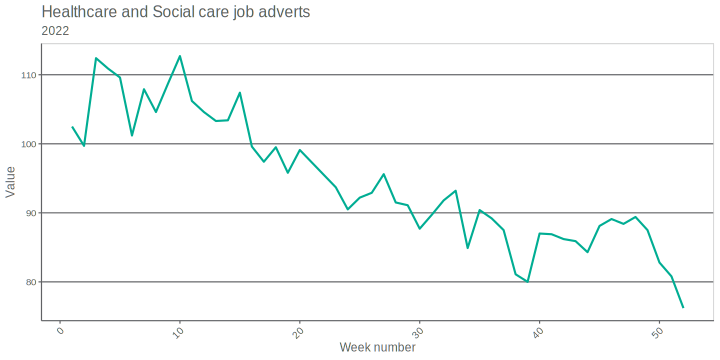

--- 
title: "RAP Workshop"
author: "Data Science Team"
date: "2023-09-06"
site: bookdown::bookdown_site
documentclass: book
bibliography: [book.bib, packages.bib]
# url: your book url like https://bookdown.org/yihui/bookdown
# cover-image: path to the social sharing image like images/cover.jpg
description: |
  This is a minimal example of using the bookdown package to write a book.
  The HTML output format for this example is bookdown::bs4_book,
  set in the _output.yml file.
biblio-style: apalike
csl: chicago-fullnote-bibliography.csl
---

# RAP Workshop

This document contains the examples and exercises for the DHSC Data Science RAP Workshop in R. This take you through:

- Reading in data
- Manipulating data
- Plotting data
- Calculating statistics

<!--chapter:end:index.Rmd-->

# Intro to plotting and calculating summary statistics

This page will take you through the steps of reading, filtering and plotting data. We will then generate summary statistics. The next page is an exercise to test your knowledge. 

## Dataset background

To obtain the data needed for this exercise, we use the onsr package, which reads in data from the ONS using their API. For this section, we'll be using data regarding online job adverts. 

ONS gives the following information on this dataset:

"Adzuna is an online job search engine who collate information from thousands of different sources in the UK. These range from direct employers’ websites to recruitment software providers to traditional job boards thus providing a comprehensive view of current online job adverts. 

Adzuna is working in partnership with ONS and have made data available for analysis including online advert job descriptions, job titles, job locations, job categories and salary information.

The data provided are a point-in-time estimate of all job adverts indexed in Adzuna’s job search engine during the point of data extraction.

These indices are created based upon job adverts provided by Adzuna. This data includes information on several million job advert entries each month, live across the UK, broken down by job category and UK countries and English regions."

## Reading in the data

We start by reading in a selection of libraries, which are collections of pre-written code that we can use to perform tasks for us. 

```
library(onsr)
library(dplyr)
library(stringr)
library(readr)
```
These packages do the following:

- onsr: reading in data from the ONS API
- dplyr: used to manipulate datasets
- stringr: we will use to manipulate strings
- readr: allows us to save a dataframe as a csv file

```
# read in info on ONS datasets and display
datasets <- ons_datasets()
print(datasets$id)

# select a dataset
job_ads <- ons_get(id = "online-job-advert-estimates")

# print columns
print(colnames(job_ads))

# print job types
print(unique(job_ads$AdzunaJobsCategory))
```

We can then call the ons_datasets function to read in various datasets. We then call the ons_get() to select the job adverts data we want. From this, we can print the column names of the dataset to see what our data looks like. We are interested in the types of jobs presented in the dataset, so we print the unique values in the AdzunaJobsCategory column. 

## Filtering data

We will use the package dplyr to clean the data and filter for last year's Health and Social care jobs data. We remove rows where the value is NA and filter the job category and time columns. We can then extract week number as a number (using the stringr package) to allow plotting the data to be straightforward. Note, the "v4_1" column is the index values we will look to plot later. 

```
# remove NAs, filter by job category, filter to 2022
health_jobs <- job_ads %>%
  filter(!is.na(v4_1)) %>%
  filter(AdzunaJobsCategory == "Healthcare and Social care") %>%
  filter(Time == 2022)

# extract week number and sort by
health_jobs_sorted <- health_jobs %>%
  mutate(week_no = str_extract(Week, "[0-9]+")) %>%
  mutate(week_no = as.numeric(week_no)) %>%
  arrange(week_no)
```

Once we have a cleaned dataset, we save as a csv. 

```
# save data to csv
write_csv(
  health_jobs_sorted,
  file = "./output/health_jobs_data.csv"
```

## Plotting data

Now we will plot the data using the package ggplot2. 

We read in the following packages:

```
library(readr)
library(ggplot2)
```

We read in the csv we just created:

```
health_jobs_sorted = read_csv("./output/health_jobs_data.csv")
```
Here we set up the plot - reading in DHSC colours, plotting a line of the index values and set the chart labels. 

```
# plot

ggplot() +
  DHSCcolours::theme_dhsc() +
  geom_line(
    data = health_jobs_sorted,
    aes(week_no, v4_1, colour = AdzunaJobsCategory),
    linewidth = 1
  ) +
  theme(legend.position="none") +
  DHSCcolours::scale_colour_dhsc_d() +
  labs(
    title = "Healthcare and Social care job adverts",
    subtitle = "2022",
    x = "Week number",
    y = "Value")
```
And save the plot

```
# save the plot
ggsave("./output/health_jobs_chart.svg",
         height = 5,
         width = 10,
         units="in",
         dpi=300)
```




## Generating summary stats

Finally, we will generate some summary statistics of the dataset.

We read in some now familiar packages:

```
library(readr)
library(dplyr)
```

We read in the data:

```
health_jobs_sorted = read_csv("./output/health_jobs_data.csv")
```

We calculate various stats:

```
# get stats

minimum <- min(health_jobs_sorted$v4_1)
maximum <- max(health_jobs_sorted$v4_1)
average <- mean(health_jobs_sorted$v4_1)
median <- median(health_jobs_sorted$v4_1)
```

We then want to filter the dataset on the maximum and minimum values to find which week these occurred in. We start by creating a list where the now already defined variables for maximum and minimum are mapped to a string, which we can print in the output i.e. set the max value to the string "maximum". We then loop over these values, retrieve the numerical value, filter on the dataset and pull the week number out. We then print these values along with the average and median already calculated. 

```
stats = list("minimum" = maximum,
             "maximum"= minimum)

# get week values for stats, print

for (name in names(stats)) {
  stat_value = stats[[name]]

  week_no <- health_jobs_sorted %>%
    filter(v4_1 == stats[[name]]) %>%
    select(week_no) %>%
    pull

  print(paste("the ",name, "value is", stat_value, "(week:", week_no, ")"))
}

print(paste("the average value is",round(average,1)))
print(paste("the median value is",round(median)))
```
This gives us some information about the dataset.

In the next section, you'll use these techniques to perform your own analysis on a different dataset.

<!--chapter:end:01-plots-summary.Rmd-->

# Exercise

In this section, you will test your R skills by completing an exercise on the subjects covered on the previous page.

Please complete the following tasks:

1. Download and clean the ONS data for Education job adverts in 2022. 

2. Plot a time series chart for vacancies, using DHSC colours. 

3. Establish which weeks had the lowest and highest index values respectfully for teaching job adverts.

4. Calculate the median and mean index values for Education job adverts in 2022. 


<!--chapter:end:02-plots-summary-exercise.Rmd-->

